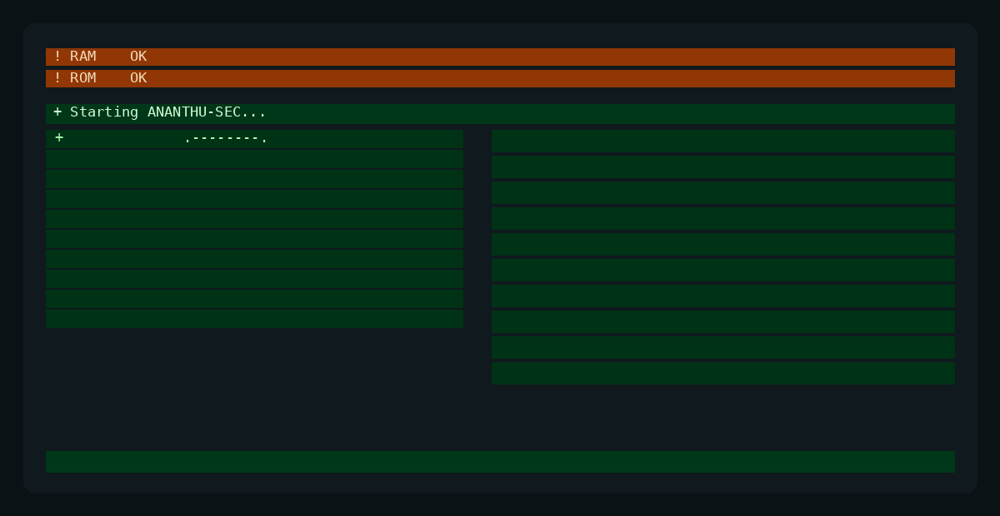

<p align="center">
  
</p>

<h1 align="center">Ananthu K Santhosh</h1>

<p align="center">
  <b>🛡️ Cybersecurity • Ethical Hacking • Cloud Security • IoT Security</b>
</p>

<p align="center">
  
  
  
  
</p>

---

## 👋 About Me

I'm a **BCA student** focused on developing practical skills in **Cybersecurity, Ethical Hacking, Cloud Security and IoT Security**.

I enjoy exploring applications, networks and cloud environments to understand how they work, identify security weaknesses and build more secure systems.

* 🎓 BCA Student
* 🛡️ Cybersecurity & Ethical Hacking
* 🔎 Vulnerability Assessment & Penetration Testing
* 🌐 Web Application Security
* ☁️ AWS & Azure Security
* 📡 IoT Security
* 🐧 Linux & Network Security

---

## 🎯 Current Focus

```text
🔐 Ethical Hacking & VAPT
🌐 Web Application Security
☁️ AWS & Azure Security
📡 IoT Security
🛡️ SOC & Security Analysis
🔍 Digital Forensics
🐧 Linux & Network Security
```

---

## 🛠️ Security Toolkit

| Category             | Technologies                                                |
| -------------------- | ----------------------------------------------------------- |
| 🛡️ Cybersecurity    | Nmap • Burp Suite • Nikto • Gobuster • Metasploit           |
| 🌐 Networking        | Wireshark • Nmap • Netcat • DNS Enumeration                 |
| ☁️ Cloud             | AWS • Azure • IAM • EC2 • S3 • VPC • RDS • KMS • CloudTrail |
| 💻 Programming       | Python • JavaScript • TypeScript                            |
| ⚙️ DevOps            | Docker • GitHub Actions • Azure DevOps • Jenkins            |
| 🐧 Operating Systems | Kali Linux • Linux                                          |
| 📡 IoT Security      | MQTT • Mosquitto • TLS • OpenSSL • Binwalk                  |

---

## 🚀 Featured Projects

### 🏥 MEDOX — Healthcare Platform

A role-based healthcare platform supporting patients, doctors and administrators.

**Technology Stack**

`Node.js` `Express.js` `Prisma` `MySQL` `React`

---

### 🔎 Network Security Lab

Hands-on networking and security laboratory covering reconnaissance, enumeration, scanning and network analysis.

**Tools**

`Kali Linux` `Nmap` `Wireshark` `Netcat` `DNS Tools`

---

### 📡 IoT Security Lab

Practical IoT security work involving MQTT security, TLS, ACLs, firmware analysis and embedded-device security.

**Tools**

`Mosquitto` `OpenSSL` `Wireshark` `Binwalk`

---

### ☁️ Cloud Security Lab

Hands-on AWS security implementation covering IAM, MFA, VPC, EC2, S3, RDS, CloudTrail and encryption.

**Platform**

`AWS`

---

## 📚 Currently Learning

```text
Ethical Hacking          ██████████████████░░
Web Application Security █████████████████░░░
Networking               █████████████████░░░
Linux Security           █████████████████░░░
Cloud Security           ███████████████░░░░░
IoT Security             █████████████░░░░░░
SOC / SIEM               ███████████░░░░░░░░
Digital Forensics        ███████████░░░░░░░░
```

---

## 🧪 Cybersecurity Interests

```text
[+] Reconnaissance
[+] Network Enumeration
[+] Web Application Security
[+] Vulnerability Assessment
[+] Penetration Testing
[+] Cloud Security
[+] IoT Security
[+] Security Monitoring
[+] Digital Forensics
[+] Linux Security
```

---

## 💻 Tech Stack

<p align="center">
  
</p>

---

## 📊 GitHub Statistics

<p align="center">
  


</p>

---

## 🔥 GitHub Streak

<p align="center">
  
</p>

---

## 🤝 Connect With Me

<p align="center">

  <a href="https://github.com/ananthuksanthosh">
    
  </a>

  <a href="https://www.linkedin.com/in/ananthu-k-santhosh">
    
  </a>

</p>

---

## 🐍 Contribution Activity

> Contribution Snake will be enabled through GitHub Actions.

---

<p align="center">
  <b>Learning • Building • Securing 🔐</b>
</p>

<p align="center">
  <sub>Cybersecurity is not just about breaking systems — it's about understanding how to protect them.</sub>
</p>
